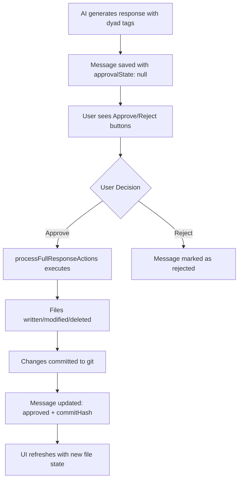
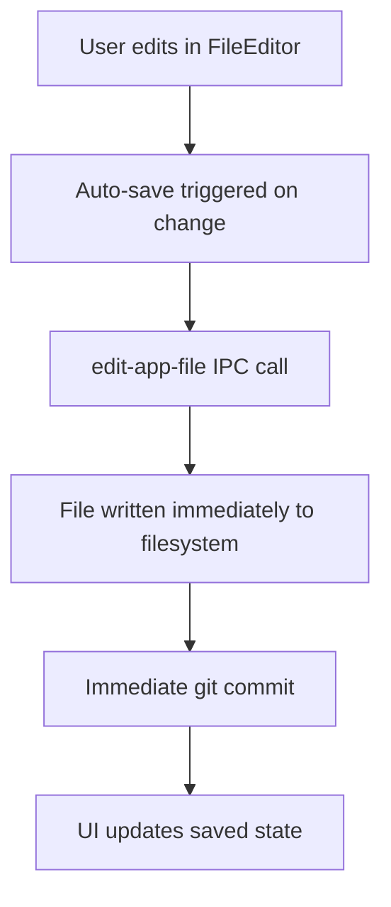

# Dyad Architecture Documentation

## Technical Implementation Guide for AI-Powered Code Editor

This document provides a comprehensive technical overview of Dyad's architecture, designed to enable implementation of similar functionality in other applications.

## Table of Contents

1. [System Overview](#system-overview)
2. [Database Schema](#database-schema)
3. [IPC Communication Pattern](#ipc-communication-pattern)
4. [Chat Streaming System](#chat-streaming-system)
5. [File Processing Pipeline](#file-processing-pipeline)
6. [Version Control Integration](#version-control-integration)
7. [Context Management](#context-management)
8. [Auto-Approval System](#auto-approval-system)
9. [Error Handling & Interruption](#error-handling--interruption)
10. [Security & Performance](#security--performance)

## System Overview

Dyad is an Electron-based AI code editor that uses a multi-process architecture:

- **Main Process**: Handles file operations, git, database, AI communication
- **Renderer Process**: React-based UI with real-time streaming updates
- **IPC Layer**: Secure communication between processes with preload script

### Core Information Flow

```
User Input → IPC → Main Process → AI Model → Streaming Response → IPC → UI Updates
         ↓
    Database → File Operations → Git Commits → Version Tracking
```

### Key Design Principles

1. **Streaming First**: All AI responses stream in real-time
2. **Git Integration**: Every change is versioned
3. **Approval-Based**: Changes require explicit user approval (unless auto-approved)
4. **Context-Aware**: AI receives relevant codebase context
5. **Safe Operations**: File-level locking prevents conflicts

## Information Flow Deep Dive

### Chat Streaming Flow

The chat system operates in distinct phases with careful timing of database operations and UI updates:

```
1. User Input → Message saved immediately to DB
2. Placeholder assistant message created (empty content)
3. AI model streams response → Real-time UI updates
4. Each chunk updates placeholder message in DB
5. Stream completes → Auto-approve OR show approve/reject buttons
6. User approval → File operations executed → Git commit → Final DB update
```

#### Timeline Breakdown

**Phase 1: Immediate Operations (< 100ms)**

- User message inserted into database with `chatId` and timestamp
- Empty placeholder assistant message created with unique `messageId`
- UI shows "thinking" animation

**Phase 2: Real-time Streaming (1-30 seconds)**

- AI model generates response incrementally
- Each text chunk updates the placeholder message content in database
- Frontend receives `chat:response:chunk` IPC events every ~100ms
- UI displays streaming text with loading animations
- **Important**: File changes are NOT applied during streaming

**Phase 3: Stream Completion**

- Final response content saved to database
- AI response parsed for `<dyad-write>`, `<dyad-rename>`, `<dyad-delete>` tags
- Chat summary extracted and stored
- Auto-approval check performed

**Phase 4: Change Application (Manual or Auto)**

- **Auto-approve enabled**: Changes applied immediately, files written, git commit created
- **Manual approval**: User sees Approve/Reject buttons, changes pending
- Database updated with `approvalState` and `commitHash`

### File Changes: Two Distinct Paths

#### Path 1: AI-Proposed Changes (Approval-Based)



**Key Characteristics:**

- Changes are **never applied during streaming**
- Requires explicit user approval (unless auto-approve enabled)
- All operations are atomic (all succeed or all fail)
- Git commit includes descriptive message with change summary
- Database message links to specific commit hash

#### Path 2: Manual File Editing (Immediate)



**Key Characteristics:**

- Changes applied **immediately** when user saves
- No approval step required
- Individual commits per file edit
- Simpler flow for direct user modifications

### When Changes Are Actually Displayed vs Saved

#### Streaming Text Display

- **Displayed**: Immediately as AI generates each chunk
- **Saved**: Each chunk updates database in real-time
- **Location**: Message content in `messages` table

#### File Changes Display

- **AI-Proposed**: Only shown in preview after user approves
- **Manual Edits**: Immediately reflected in file editor and preview
- **Database**: File changes tracked via git commit hashes in messages

#### Database Timing

```typescript
// During streaming - frequent updates
await db
  .update(messages)
  .set({ content: partialResponse })
  .where(eq(messages.id, placeholderMessageId));

// After approval - final state update
await db
  .update(messages)
  .set({
    approvalState: 'approved',
    commitHash: gitCommitHash,
  })
  .where(eq(messages.id, messageId));
```

### Agentic Coding Pipeline

The agentic coding pipeline is the heart of Dyad's AI-powered development capabilities. It transforms natural language requests into structured code changes through a sophisticated multi-stage process that maintains safety, context awareness, and version control.

#### Overview: From Prompt to Production Code

```
User Prompt → Context Gathering → AI Processing → Tag Extraction → File Operations → Git Commit
     ↓              ↓                ↓               ↓               ↓            ↓
"Add a button" → Codebase files → Streaming AI → <dyad-write> → Button.tsx → [dyad] Added button
```

The pipeline operates on the principle of **structured AI output** - rather than generating free-form code, the AI produces responses with special XML-like tags that specify exactly what operations to perform.

#### 1. Context Extraction Phase

The system intelligently gathers relevant codebase information to provide the AI with necessary context:

```typescript
// src/utils/codebase.ts - Main extraction function
export async function extractCodebase({
  appPath,
  chatContext,
  virtualFileSystem,
}: {
  appPath: string;
  chatContext: AppChatContext;
  virtualFileSystem?: AsyncVirtualFileSystem;
}): Promise<{ formattedOutput: string; files: CodebaseFile[] }> {
  // 1. Collect all files in the project
  let files = await collectFiles(appPath, appPath);

  // 2. Apply context filtering based on user configuration
  const { contextPaths, smartContextAutoIncludes } = chatContext;
  const includedFiles = new Set<string>();

  // Process user-defined context paths (e.g., "src/components/**/*.tsx")
  if (contextPaths && contextPaths.length > 0) {
    for (const p of contextPaths) {
      const pattern = createFullGlobPath({ appPath, globPath: p.globPath });
      const matches = await glob(pattern, {
        nodir: true,
        absolute: true,
        ignore: '**/node_modules/**',
      });
      matches.forEach(file => includedFiles.add(path.normalize(file)));
    }

    // STRICT MODE: Only include files matching contextPaths
    files = files.filter(file => includedFiles.has(path.normalize(file)));
  }

  // 3. Add AI-suggested files (Pro feature)
  const isSmartContextEnabled = settings?.enableDyadPro && settings?.enableProSmartFilesContextMode;
  if (isSmartContextEnabled && smartContextAutoIncludes?.length > 0) {
    for (const p of smartContextAutoIncludes) {
      const pattern = createFullGlobPath({ appPath, globPath: p.globPath });
      const matches = await glob(pattern, { nodir: true, absolute: true });
      matches.forEach(file => includedFiles.add(path.normalize(file)));
    }
  }

  // 4. Format files for AI consumption
  let formattedOutput = '';
  for (const file of sortedFiles) {
    const relativePath = path.relative(appPath, file);
    const content = await readFileWithCache(file);

    // Skip large files or omitted patterns
    if (content.length > MAX_FILE_SIZE || isOmittedFile(relativePath)) {
      formattedOutput += `\n---\n**File: ${relativePath}**\n[File contents omitted]\n`;
      continue;
    }

    formattedOutput += `\n---\n**File: ${relativePath}**\n\`\`\`\n${content}\n\`\`\`\n`;
  }

  return { formattedOutput, files };
}

// File filtering with performance constraints
const ALLOWED_EXTENSIONS = [
  '.ts',
  '.tsx',
  '.js',
  '.jsx',
  '.css',
  '.html',
  '.md',
  '.astro',
  '.vue',
  '.svelte',
  '.yml',
  '.yaml',
];
const MAX_FILE_SIZE = 1000 * 1024; // 1MB limit
const EXCLUDED_DIRS = ['node_modules', '.git', 'dist', 'build'];
```

**Context Selection Strategies:**

1. **Default Mode**: Include all relevant files (filtered by extension and size)
2. **User-Configured**: Only files matching glob patterns in `app.chatContext`
3. **Smart Context (Pro)**: AI-suggested relevant files based on prompt analysis
4. **Component Selection**: Single file context when user selects specific component

#### 2. System Prompt Construction

The AI receives a carefully constructed prompt that includes coding guidelines, codebase context, and tool specifications:

```typescript
// src/prompts/system_prompt.ts - Core system prompt structure
const BUILD_SYSTEM_PROMPT = `
<role>You are Dyad, an AI editor that creates and modifies web applications. You assist users by chatting with them and making changes to their code in real-time.</role>

# Guidelines

- Use <dyad-write> for creating or updating files
- Use <dyad-rename> for renaming files
- Use <dyad-delete> for removing files
- Use <dyad-add-dependency> for installing packages
- Use <dyad-chat-summary> for setting the chat summary
- Always reply to the user in the same language they are using

# Examples

<dyad-write path="src/components/Button.tsx" description="Creating a new Button component">
import React from 'react';

interface ButtonProps {
  children: React.ReactNode;
  onClick?: () => void;
  variant?: 'primary' | 'secondary';
}

export const Button: React.FC<ButtonProps> = ({ children, onClick, variant = 'primary' }) => {
  return (
    <button
      className={\`btn \${variant === 'primary' ? 'btn-primary' : 'btn-secondary'}\`}
      onClick={onClick}
    >
      {children}
    </button>
  );
};
</dyad-write>

<dyad-add-dependency packages="@types/react"></dyad-add-dependency>
<dyad-chat-summary>Added Button component</dyad-chat-summary>
`;

// Prompt assembly in chat handler
function constructSystemPrompt({
  aiRules,
  chatMode,
}: {
  aiRules: string | undefined;
  chatMode: 'build' | 'ask';
}) {
  const systemPrompt = chatMode === 'ask' ? ASK_MODE_SYSTEM_PROMPT : BUILD_SYSTEM_PROMPT;
  return systemPrompt.replace('[[AI_RULES]]', aiRules ?? DEFAULT_AI_RULES);
}

// Full message construction for AI
const chatMessages = [
  {
    role: 'user',
    content: createCodebasePrompt(codebaseInfo), // Inject codebase context
  },
  ...limitedMessageHistory, // Recent conversation
  {
    role: 'user',
    content: req.prompt, // Current user request
  },
];
```

#### 3. Model Streaming with Structured Output

The AI model generates responses in real-time with embedded action tags:

```typescript
// src/ipc/handlers/chat_stream_handlers.ts - Streaming implementation
const { fullStream } = await simpleStreamText({
  chatMessages,
  modelClient,
});

// Process stream chunks in real-time
for await (const part of fullStream) {
  let chunk = '';
  if (part.type === 'text-delta') {
    chunk = part.textDelta;
  } else if (part.type === 'reasoning') {
    // Handle AI thinking/reasoning blocks
    chunk = `<think>${escapeDyadTags(part.textDelta)}</think>`;
  }

  fullResponse += chunk;
  fullResponse = cleanFullResponse(fullResponse);

  // Update database and UI in real-time
  fullResponse = await processResponseChunkUpdate({ fullResponse });
}

// Example AI response with structured output
const exampleResponse = `
I'll create a reusable Button component with TypeScript support.

<dyad-write path="src/components/Button.tsx" description="Creating a reusable Button component with variants">
import React from 'react';
import { cn } from '@/lib/utils';

interface ButtonProps extends React.ButtonHTMLAttributes<HTMLButtonElement> {
  variant?: 'primary' | 'secondary' | 'destructive';
  size?: 'sm' | 'md' | 'lg';
  children: React.ReactNode;
}

export const Button = React.forwardRef<HTMLButtonElement, ButtonProps>(
  ({ className, variant = 'primary', size = 'md', children, ...props }, ref) => {
    return (
      <button
        className={cn(
          'inline-flex items-center justify-center rounded-md font-medium transition-colors',
          'focus-visible:outline-none focus-visible:ring-2 focus-visible:ring-ring',
          'disabled:pointer-events-none disabled:opacity-50',
          {
            'bg-primary text-primary-foreground hover:bg-primary/90': variant === 'primary',
            'bg-secondary text-secondary-foreground hover:bg-secondary/80': variant === 'secondary',
            'bg-destructive text-destructive-foreground hover:bg-destructive/90': variant === 'destructive',
          },
          {
            'h-9 px-3 text-sm': size === 'sm',
            'h-10 px-4 py-2': size === 'md',
            'h-11 px-6 text-lg': size === 'lg',
          },
          className
        )}
        ref={ref}
        {...props}
      >
        {children}
      </button>
    );
  }
);

Button.displayName = 'Button';
</dyad-write>

<dyad-write path="src/components/index.ts" description="Exporting Button component">
export { Button } from './Button';
</dyad-write>

<dyad-add-dependency packages="class-variance-authority clsx tailwind-merge"></dyad-add-dependency>

<dyad-chat-summary>Added reusable Button component</dyad-chat-summary>

The Button component is now ready with multiple variants (primary, secondary, destructive) and sizes (sm, md, lg). It follows modern React patterns with forwardRef and proper TypeScript support.
`;
```

#### 4. Tag Processing & Validation

After streaming completes, the system extracts and validates all action tags:

```typescript
// src/ipc/utils/tag_extraction.ts - Tag parsing utilities
export function getDyadWriteTags(response: string): Array<{
  path: string;
  content: string;
  description?: string;
}> {
  const writeTagRegex =
    /<dyad-write\s+path="([^"]+)"(?:\s+description="([^"]*)")?\s*>([\s\S]*?)<\/dyad-write>/g;
  const tags = [];
  let match;

  while ((match = writeTagRegex.exec(response)) !== null) {
    tags.push({
      path: match[1],
      description: match[2] || undefined,
      content: match[3].trim(),
    });
  }

  return tags;
}

export function getDyadRenameTags(response: string): Array<{
  from: string;
  to: string;
}> {
  const renameTagRegex = /<dyad-rename\s+from="([^"]+)"\s+to="([^"]+)"\s*(?:\/>|><\/dyad-rename>)/g;
  const tags = [];
  let match;

  while ((match = renameTagRegex.exec(response)) !== null) {
    tags.push({
      from: match[1],
      to: match[2],
    });
  }

  return tags;
}

export function getDyadDeleteTags(response: string): string[] {
  const deleteTagRegex = /<dyad-delete\s+path="([^"]+)"\s*(?:\/>|><\/dyad-delete>)/g;
  const paths = [];
  let match;

  while ((match = deleteTagRegex.exec(response)) !== null) {
    paths.push(match[1]);
  }

  return paths;
}

export function getDyadAddDependencyTags(response: string): string[] {
  const depTagRegex =
    /<dyad-add-dependency\s+packages="([^"]+)"\s*(?:\/>|><\/dyad-add-dependency>)/g;
  const packages = [];
  let match;

  while ((match = depTagRegex.exec(response)) !== null) {
    packages.push(match[1]);
  }

  return packages;
}

// Security validation for all file paths
function validateFilePath(filePath: string, appPath: string): void {
  const fullPath = safeJoin(appPath, filePath);

  // Ensure path doesn't escape app directory
  if (!fullPath.startsWith(path.resolve(appPath))) {
    throw new Error(`Path escapes app directory: ${filePath}`);
  }

  // Check for malicious patterns
  if (filePath.includes('..') || path.isAbsolute(filePath)) {
    throw new Error(`Invalid file path: ${filePath}`);
  }
}
```

#### 5. Auto-Fix Integration (TypeScript Error Detection)

When enabled, the system automatically detects and fixes TypeScript compilation errors:

```typescript
// src/ipc/handlers/chat_stream_handlers.ts - Auto-fix pipeline
if (
  settings.enableAutoFixProblems &&
  addDependencies.length === 0 && // Don't auto-fix if deps need installing
  !abortController.signal.aborted
) {
  try {
    // Generate problem report using TypeScript compiler
    let problemReport = await generateProblemReport({
      fullResponse,
      appPath: getDyadAppPath(updatedChat.app.path),
    });

    let autoFixAttempts = 0;
    const originalFullResponse = fullResponse;

    // Attempt to fix problems (max 2 attempts)
    while (
      problemReport.problems.length > 0 &&
      autoFixAttempts < 2 &&
      !abortController.signal.aborted
    ) {
      // Add problem report to response
      fullResponse += `<dyad-problem-report summary="${problemReport.problems.length} problems">
${problemReport.problems
  .map(
    problem =>
      `<problem file="${escapeXml(problem.file)}" line="${problem.line}" column="${problem.column}" code="${problem.code}">${escapeXml(problem.message)}</problem>`
  )
  .join('\n')}
</dyad-problem-report>`;

      logger.info(`Auto-fixing problems, attempt #${autoFixAttempts + 1}`);
      autoFixAttempts++;

      // Create virtual file system with proposed changes
      const virtualFileSystem = new AsyncVirtualFileSystem(appPath, {
        fileExists: (fileName: string) => fileExists(fileName),
        readFile: (fileName: string) => readFileWithCache(fileName),
      });

      // Apply AI's proposed changes to virtual filesystem
      const writeTags = getDyadWriteTags(fullResponse);
      const renameTags = getDyadRenameTags(fullResponse);
      const deletePaths = getDyadDeleteTags(fullResponse);

      virtualFileSystem.applyResponseChanges({
        deletePaths,
        renameTags,
        writeTags,
      });

      // Re-extract codebase with virtual changes
      const { formattedOutput: codebaseInfo } = await extractCodebase({
        appPath,
        chatContext,
        virtualFileSystem,
      });

      // Generate fix prompt
      const problemFixPrompt = createProblemFixPrompt(problemReport);

      // Stream AI response to fix problems
      const { fullStream } = await simpleStreamText({
        modelClient,
        chatMessages: [
          ...chatMessages.map((msg, index) => {
            if (
              index === 0 &&
              msg.role === 'user' &&
              typeof msg.content === 'string' &&
              msg.content.startsWith(CODEBASE_PROMPT_PREFIX)
            ) {
              return {
                role: 'user',
                content: createCodebasePrompt(codebaseInfo),
              } as const;
            }
            return msg;
          }),
          { role: 'assistant', content: originalFullResponse },
          { role: 'user', content: problemFixPrompt },
        ],
      });

      // Process fix response
      for await (const part of fullStream) {
        if (abortController.signal.aborted) break;
        if (part.type !== 'text-delta') continue;

        fullResponse += part.textDelta;
        fullResponse = cleanFullResponse(fullResponse);
        fullResponse = await processResponseChunkUpdate({ fullResponse });
      }

      // Re-check for problems
      problemReport = await generateProblemReport({
        fullResponse,
        appPath,
      });
    }

    if (problemReport.problems.length > 0) {
      logger.warn(`Auto-fix completed with ${problemReport.problems.length} remaining problems`);
    } else {
      logger.info('Auto-fix successfully resolved all problems');
    }
  } catch (error) {
    logger.error('Error in auto-fix:', error);
    // Continue without auto-fix
  }
}

// Problem detection using TypeScript compiler
async function generateProblemReport({
  fullResponse,
  appPath,
}: {
  fullResponse: string;
  appPath: string;
}): Promise<{ problems: Problem[] }> {
  // Create temporary files with proposed changes
  const tempDir = path.join(os.tmpdir(), `dyad-temp-${Date.now()}`);
  await fs.promises.mkdir(tempDir, { recursive: true });

  try {
    // Apply changes to temp directory
    const writeTags = getDyadWriteTags(fullResponse);
    for (const tag of writeTags) {
      const tempFilePath = path.join(tempDir, tag.path);
      await fs.promises.mkdir(path.dirname(tempFilePath), { recursive: true });
      await fs.promises.writeFile(tempFilePath, tag.content);
    }

    // Run TypeScript compiler
    const tscResults = await runTypeScriptCompiler(tempDir);

    return {
      problems: tscResults.errors.map(error => ({
        file: error.file,
        line: error.line,
        column: error.column,
        code: error.code,
        message: error.message,
        severity: 'error',
      })),
    };
  } finally {
    // Cleanup temp directory
    await fs.promises.rm(tempDir, { recursive: true, force: true });
  }
}
```

#### 6. Git Integration & Version Tracking

Every approved change creates a git commit with descriptive metadata:

```typescript
// src/ipc/processors/response_processor.ts - Git integration
export async function processFullResponseActions(
  fullResponse: string,
  chatId: number,
  { messageId }: { messageId: number }
): Promise<{ updatedFiles?: boolean; error?: string }> {
  const chatWithApp = await db.query.chats.findFirst({
    where: eq(chats.id, chatId),
    with: { app: true },
  });

  const appPath = getDyadAppPath(chatWithApp.app.path);
  const writtenFiles: string[] = [];
  const renamedFiles: string[] = [];
  const deletedFiles: string[] = [];

  // Process all file operations atomically
  try {
    // 1. Process deletions first
    for (const deletePath of dyadDeletePaths) {
      const fullPath = safeJoin(appPath, deletePath);
      if (fs.existsSync(fullPath)) {
        await fsPromises.unlink(fullPath);
        deletedFiles.push(deletePath);
      }
    }

    // 2. Process renames
    for (const tag of dyadRenameTags) {
      const fromPath = safeJoin(appPath, tag.from);
      const toPath = safeJoin(appPath, tag.to);

      if (fs.existsSync(fromPath)) {
        await fsPromises.mkdir(path.dirname(toPath), { recursive: true });
        await fsPromises.rename(fromPath, toPath);
        renamedFiles.push(`${tag.from} → ${tag.to}`);
      }
    }

    // 3. Process file writes
    for (const tag of dyadWriteTags) {
      const fullFilePath = safeJoin(appPath, tag.path);

      // Ensure directory exists
      await fsPromises.mkdir(path.dirname(fullFilePath), { recursive: true });

      // Write file content
      await fsPromises.writeFile(fullFilePath, tag.content, 'utf-8');
      writtenFiles.push(tag.path);
    }

    // 4. Install dependencies
    for (const packageList of dyadAddDependencyPackages) {
      await executeAddDependency({
        appPath,
        packages: packageList.split(' ').filter(Boolean),
      });
    }

    // 5. Create atomic git commit
    const hasChanges =
      writtenFiles.length > 0 || renamedFiles.length > 0 || deletedFiles.length > 0;

    if (hasChanges) {
      // Stage all changes
      for (const file of writtenFiles) {
        await git.add({ fs, dir: appPath, filepath: file });
      }

      // Create descriptive commit message
      const changes = [];
      if (writtenFiles.length > 0) changes.push(`wrote ${writtenFiles.length} file(s)`);
      if (renamedFiles.length > 0) changes.push(`renamed ${renamedFiles.length} file(s)`);
      if (deletedFiles.length > 0) changes.push(`deleted ${deletedFiles.length} file(s)`);
      if (dyadAddDependencyPackages.length > 0) {
        changes.push(`added ${dyadAddDependencyPackages.join(', ')} package(s)`);
      }

      const chatSummary = getDyadChatSummaryTag(fullResponse);
      const message = chatSummary
        ? `[dyad] ${chatSummary} - ${changes.join(', ')}`
        : `[dyad] ${changes.join(', ')}`;

      // Commit all changes atomically
      const commitHash = await gitCommit({ path: appPath, message });

      // Link commit to database message
      await db
        .update(messages)
        .set({
          commitHash,
          approvalState: 'approved',
        })
        .where(eq(messages.id, messageId));

      logger.log(`Successfully committed: ${message}`);
    }

    return { updatedFiles: hasChanges };
  } catch (error) {
    logger.error('Error processing files:', error);
    return { error: error.toString() };
  }
}

// Dependency installation handler
async function executeAddDependency({
  appPath,
  packages,
}: {
  appPath: string;
  packages: string[];
}): Promise<void> {
  // Detect package manager
  const hasYarnLock = fs.existsSync(path.join(appPath, 'yarn.lock'));
  const hasPnpmLock = fs.existsSync(path.join(appPath, 'pnpm-lock.yaml'));

  let command: string;
  if (hasPnpmLock) {
    command = `pnpm add ${packages.join(' ')}`;
  } else if (hasYarnLock) {
    command = `yarn add ${packages.join(' ')}`;
  } else {
    command = `npm install ${packages.join(' ')}`;
  }

  // Execute installation
  const { stdout, stderr } = await execAsync(command, {
    cwd: appPath,
    timeout: 120000, // 2 minute timeout
  });

  logger.log(`Dependency installation: ${command}`);
  if (stderr) logger.warn(`Dependency warnings: ${stderr}`);
}
```

#### 7. Database State Synchronization

The final step ensures perfect consistency between file system state and database records:

```typescript
// Linking every approved change to its git commit
await db
  .update(messages)
  .set({
    approvalState: 'approved',
    commitHash: commitHash, // Links to exact git commit
    content: cleanedResponse, // Final cleaned response
  })
  .where(eq(messages.id, messageId));

// This enables precise rollbacks - revert to any message's commit
const messageWithCommit = await db.query.messages.findFirst({
  where: eq(messages.commitHash, targetCommitHash),
  with: { chat: true },
});

// When reverting, delete all subsequent messages
if (messageWithCommit) {
  await db
    .delete(messages)
    .where(
      and(eq(messages.chatId, messageWithCommit.chatId), gt(messages.id, messageWithCommit.id))
    );
}
```

#### Pipeline Execution Flow

The complete pipeline executes as follows:

1. **Trigger**: User sends prompt in chat
2. **Context**: System gathers relevant codebase files (respecting configuration)
3. **AI Processing**: Model streams structured response with action tags
4. **Real-time Updates**: UI shows streaming text, database updated incrementally
5. **Completion**: Stream ends, tags extracted and validated
6. **Approval Gate**:
   - Auto-approve enabled → Immediate execution
   - Manual approval → User sees approve/reject buttons
7. **Execution**: File operations performed atomically
8. **Auto-fix** (optional): TypeScript errors detected and fixed automatically
9. **Git Commit**: All changes committed with descriptive message
10. **Sync**: Database updated with commit hash and approval state

This pipeline ensures that every AI-generated change is traceable, reversible, and maintains the integrity of both the codebase and the conversation history.

### Critical Timing Insights

#### What Happens When During Streaming

- ✅ **Database writes**: Message content updated in real-time
- ✅ **UI updates**: Streaming text displayed immediately
- ❌ **File changes**: Never applied during streaming
- ❌ **Git commits**: Only after user approval
- ❌ **Dependencies**: Not installed until approval

#### Auto-Approval Timing

When auto-approval is enabled:

```typescript
// Stream completes → Immediately process file operations
if (settings.autoApproveChanges) {
  const status = await processFullResponseActions(fullResponse, chatId, { messageId });
  // Files written, git commit created, database updated - all synchronous
}
```

#### Manual Approval Timing

When auto-approval is disabled:

```typescript
// Stream completes → Show UI buttons → Wait for user → Process on approval
safeSend(event.sender, 'chat:response:end', {
  chatId,
  updatedFiles: false, // No files changed yet
});

// Later, when user clicks "Approve"...
await processFullResponseActions(messageContent, chatId, { messageId });
```

This architecture ensures that users always have control over file changes while providing the option for streamlined auto-approval when desired. The streaming system provides immediate feedback while maintaining safety through the approval gate.

## Database Schema

### Core Tables

```sql
-- Applications (projects)
CREATE TABLE `apps` (
  `id` integer PRIMARY KEY AUTOINCREMENT NOT NULL,
  `name` text NOT NULL,
  `path` text NOT NULL,
  `created_at` integer DEFAULT (unixepoch()) NOT NULL,
  `updated_at` integer DEFAULT (unixepoch()) NOT NULL,
  `github_org` text,
  `github_repo` text,
  `github_branch` text,
  `supabase_project_id` text,
  `vercel_project_id` text,
  `vercel_project_name` text,
  `vercel_team_id` text,
  `vercel_deployment_url` text,
  `chat_context` text -- JSON: AppChatContext
);

-- Chat sessions
CREATE TABLE `chats` (
  `id` integer PRIMARY KEY AUTOINCREMENT NOT NULL,
  `app_id` integer NOT NULL,
  `title` text,
  `initial_commit_hash` text,
  `created_at` integer DEFAULT (unixepoch()) NOT NULL,
  FOREIGN KEY (`app_id`) REFERENCES `apps`(`id`) ON DELETE cascade
);

-- Messages in chats
CREATE TABLE `messages` (
  `id` integer PRIMARY KEY AUTOINCREMENT NOT NULL,
  `chat_id` integer NOT NULL,
  `role` text NOT NULL, -- 'user' | 'assistant'
  `content` text NOT NULL,
  `approval_state` text, -- 'approved' | 'rejected' | null
  `commit_hash` text, -- Git commit hash when approved
  `created_at` integer DEFAULT (unixepoch()) NOT NULL,
  FOREIGN KEY (`chat_id`) REFERENCES `chats`(`id`) ON DELETE cascade
);
```

### TypeScript Schemas

```typescript
// App context configuration
export const AppChatContextSchema = z.object({
  contextPaths: z.array(GlobPathSchema), // User-defined patterns
  smartContextAutoIncludes: z.array(GlobPathSchema), // AI-suggested files
});

export const GlobPathSchema = z.object({
  globPath: z.string(), // e.g., "src/components/**/*.tsx"
});

// Message types
interface Message {
  id: number;
  chatId: number;
  role: 'user' | 'assistant';
  content: string;
  approvalState?: 'approved' | 'rejected';
  commitHash?: string;
  createdAt: Date;
}
```

## IPC Communication Pattern

### Preload Script Security

```typescript
// src/preload.ts - Allowlist approach
const validInvokeChannels = [
  'chat:stream',
  'chat:cancel',
  'approve-proposal',
  'reject-proposal',
  'edit-app-file',
  // ... other allowed channels
];

const validReceiveChannels = [
  'chat:response:chunk',
  'chat:response:end',
  'chat:response:error',
  'app:output',
];

contextBridge.exposeInMainWorld('electron', {
  ipcRenderer: {
    invoke: (channel: ValidInvokeChannel, ...args: unknown[]) => {
      if (validInvokeChannels.includes(channel)) {
        return ipcRenderer.invoke(channel, ...args);
      }
      throw new Error(`Invalid channel: ${channel}`);
    },
    on: (channel: ValidReceiveChannel, listener: (...args: unknown[]) => void) => {
      if (validReceiveChannels.includes(channel)) {
        // ... setup listener
      }
    },
  },
});
```

### IPC Client Pattern

```typescript
// src/ipc/ipc_client.ts
export class IpcClient {
  private static instance: IpcClient;
  private ipcRenderer: IpcRenderer;
  private chatStreams: Map<number, ChatStreamCallbacks>;

  static getInstance(): IpcClient {
    if (!IpcClient.instance) {
      IpcClient.instance = new IpcClient();
    }
    return IpcClient.instance;
  }

  private constructor() {
    this.ipcRenderer = (window as any).electron.ipcRenderer;
    this.chatStreams = new Map();

    // Setup streaming listeners
    this.ipcRenderer.on('chat:response:chunk', data => {
      const { chatId, messages } = data as { chatId: number; messages: Message[] };
      const callbacks = this.chatStreams.get(chatId);
      if (callbacks) {
        callbacks.onUpdate(messages);
      }
    });
  }

  public streamMessage(
    prompt: string,
    options: {
      chatId: number;
      onUpdate: (messages: Message[]) => void;
      onEnd: (response: ChatResponseEnd) => void;
      onError?: (error: string) => void;
    }
  ) {
    this.chatStreams.set(options.chatId, {
      onUpdate: options.onUpdate,
      onEnd: options.onEnd,
      onError: options.onError,
    });

    return this.ipcRenderer.invoke('chat:stream', {
      chatId: options.chatId,
      prompt,
      // ... other options
    });
  }
}
```

### Main Process Handler Pattern

```typescript
// src/ipc/handlers/chat_stream_handlers.ts
export function registerChatStreamHandlers() {
  ipcMain.handle('chat:stream', async (event, req: ChatStreamParams) => {
    // Implementation details below...
  });
}

// Safe IPC sender utility
function safeSend(sender: WebContents, channel: string, data: any) {
  if (!sender.isDestroyed() && !sender.isCrashed()) {
    sender.send(channel, data);
  }
}
```

## Chat Streaming System

### Core Streaming Flow

```typescript
// Main streaming handler
ipcMain.handle('chat:stream', async (event, req: ChatStreamParams) => {
  try {
    // 1. Setup abort controller for cancellation
    const abortController = new AbortController();
    activeStreams.set(req.chatId, abortController);

    // 2. Get chat and validate
    const chat = await db.query.chats.findFirst({
      where: eq(chats.id, req.chatId),
      with: { messages: true, app: true },
    });

    // 3. Handle redo (delete recent messages if needed)
    if (req.redo) {
      // Delete last user/assistant message pair
      await handleRedoCleanup(chat.messages);
    }

    // 4. Save user message immediately
    await db.insert(messages).values({
      chatId: req.chatId,
      role: 'user',
      content: req.prompt,
    });

    // 5. Create placeholder assistant message
    const [placeholderMessage] = await db
      .insert(messages)
      .values({
        chatId: req.chatId,
        role: 'assistant',
        content: '', // Will be updated during streaming
      })
      .returning();

    // 6. Extract codebase context
    const { formattedOutput: codebaseInfo } = await extractCodebase({
      appPath: getDyadAppPath(chat.app.path),
      chatContext: validateChatContext(chat.app.chatContext),
    });

    // 7. Setup streaming update handler
    const processResponseChunkUpdate = async ({ fullResponse }) => {
      // Update placeholder message in database
      await db
        .update(messages)
        .set({ content: fullResponse })
        .where(eq(messages.id, placeholderMessage.id));

      // Send real-time update to UI
      const currentMessages = [
        ...chat.messages,
        {
          ...placeholderMessage,
          content: fullResponse,
        },
      ];

      safeSend(event.sender, 'chat:response:chunk', {
        chatId: req.chatId,
        messages: currentMessages,
      });

      return fullResponse;
    };

    // 8. Stream from AI model
    const { fullStream } = await simpleStreamText({
      chatMessages: buildChatHistory(chat.messages, codebaseInfo),
      modelClient,
    });

    // 9. Process stream chunks
    let fullResponse = '';
    for await (const part of fullStream) {
      if (abortController.signal.aborted) break;

      let chunk = '';
      if (part.type === 'text-delta') {
        chunk = part.textDelta;
      } else if (part.type === 'reasoning') {
        chunk = `<think>${part.textDelta}</think>`;
      }

      fullResponse += chunk;
      fullResponse = cleanFullResponse(fullResponse);
      fullResponse = await processResponseChunkUpdate({ fullResponse });
    }

    // 10. Handle auto-approval or manual approval
    if (settings.autoApproveChanges && settings.selectedChatMode !== 'ask') {
      const status = await processFullResponseActions(fullResponse, req.chatId, {
        messageId: placeholderMessage.id,
      });

      safeSend(event.sender, 'chat:response:end', {
        chatId: req.chatId,
        updatedFiles: status.updatedFiles ?? false,
        extraFiles: status.extraFiles,
      });
    } else {
      safeSend(event.sender, 'chat:response:end', {
        chatId: req.chatId,
        updatedFiles: false,
      });
    }
  } catch (error) {
    safeSend(event.sender, 'chat:response:error', `Error processing request: ${error}`);
  }
});
```

### Stream Interruption Handling

```typescript
// Cancellation handler
ipcMain.handle('chat:cancel', async (event, chatId: number) => {
  const abortController = activeStreams.get(chatId);

  if (abortController) {
    abortController.abort();
    activeStreams.delete(chatId);

    // Save partial response if available
    const partialResponse = partialResponses.get(chatId);
    if (partialResponse) {
      await db
        .update(messages)
        .set({
          content: `${partialResponse}\n\n[Response cancelled by user]`,
        })
        .where(eq(messages.id, placeholderMessageId));
    }
  }

  safeSend(event.sender, 'chat:response:end', {
    chatId,
    updatedFiles: false,
  });
});
```

### React Hook Integration

```typescript
// src/hooks/useStreamChat.ts
export function useStreamChat() {
  const [isStreaming, setIsStreaming] = useState(false);
  const [messages, setMessages] = useState<Message[]>([]);
  const [error, setError] = useState<string | null>(null);

  const streamMessage = useCallback(async ({ prompt, chatId, attachments, selectedComponent }) => {
    setError(null);
    setIsStreaming(true);

    try {
      await IpcClient.getInstance().streamMessage(prompt, {
        chatId,
        attachments,
        selectedComponent,
        onUpdate: (updatedMessages: Message[]) => {
          setMessages(updatedMessages);
        },
        onEnd: (response: ChatResponseEnd) => {
          setIsStreaming(false);
          if (response.updatedFiles) {
            setIsPreviewOpen(true);
            refreshAppIframe();
          }
          refreshProposal(chatId);
          refreshChats();
          refreshApp();
          refreshVersions();
        },
        onError: (error: string) => {
          setError(error);
          setIsStreaming(false);
        },
      });
    } catch (err) {
      setError(err.message);
      setIsStreaming(false);
    }
  }, []);

  return { streamMessage, isStreaming, messages, error };
}
```

## File Processing Pipeline

### AI Response Tag Processing

Dyad uses custom XML-like tags in AI responses to specify file operations:

```typescript
// Example AI response with tags
const aiResponse = `
I'll create a new component for you.

<dyad-write path="src/components/Button.tsx" description="Creating a reusable Button component">
import React from 'react';

interface ButtonProps {
  children: React.ReactNode;
  onClick?: () => void;
  variant?: 'primary' | 'secondary';
}

export const Button: React.FC<ButtonProps> = ({
  children,
  onClick,
  variant = 'primary'
}) => {
  const className = variant === 'primary' ? 'btn-primary' : 'btn-secondary';

  return (
    <button className={className} onClick={onClick}>
      {children}
    </button>
  );
};
</dyad-write>

<dyad-add-dependency packages="@types/react react"></dyad-add-dependency>

<dyad-chat-summary>Added Button component</dyad-chat-summary>
`;
```

### Tag Extraction and Processing

```typescript
// src/ipc/processors/response_processor.ts
export async function processFullResponseActions(
  fullResponse: string,
  chatId: number,
  { messageId }: { messageId: number }
): Promise<{
  updatedFiles?: boolean;
  error?: string;
  extraFiles?: string[];
}> {
  // 1. Extract all action tags
  const dyadWriteTags = getDyadWriteTags(fullResponse);
  const dyadRenameTags = getDyadRenameTags(fullResponse);
  const dyadDeletePaths = getDyadDeleteTags(fullResponse);
  const dyadAddDependencyPackages = getDyadAddDependencyTags(fullResponse);
  const dyadExecuteSqlQueries = getDyadExecuteSqlTags(fullResponse);

  // 2. Get app and chat info
  const chatWithApp = await db.query.chats.findFirst({
    where: eq(chats.id, chatId),
    with: { app: true },
  });

  const appPath = getDyadAppPath(chatWithApp.app.path);
  const writtenFiles: string[] = [];
  const renamedFiles: string[] = [];
  const deletedFiles: string[] = [];

  try {
    // 3. Process file deletions first
    for (const deletePath of dyadDeletePaths) {
      const fullPath = safeJoin(appPath, deletePath);
      if (fs.existsSync(fullPath)) {
        await fsPromises.unlink(fullPath);
        deletedFiles.push(deletePath);
        logger.log(`Successfully deleted file: ${fullPath}`);
      }
    }

    // 4. Process file renames
    for (const tag of dyadRenameTags) {
      const fromPath = safeJoin(appPath, tag.from);
      const toPath = safeJoin(appPath, tag.to);

      if (fs.existsSync(fromPath)) {
        // Ensure target directory exists
        await fsPromises.mkdir(path.dirname(toPath), { recursive: true });
        await fsPromises.rename(fromPath, toPath);
        renamedFiles.push(`${tag.from} → ${tag.to}`);
        logger.log(`Successfully renamed: ${fromPath} → ${toPath}`);
      }
    }

    // 5. Process file writes
    for (const tag of dyadWriteTags) {
      const filePath = tag.path;
      const content = tag.content;
      const fullFilePath = safeJoin(appPath, filePath);

      // Ensure directory exists
      const dirPath = path.dirname(fullFilePath);
      await fsPromises.mkdir(dirPath, { recursive: true });

      // Write file content
      await fsPromises.writeFile(fullFilePath, content, 'utf-8');
      logger.log(`Successfully wrote file: ${fullFilePath}`);
      writtenFiles.push(filePath);
    }

    // 6. Process dependency additions
    for (const packageList of dyadAddDependencyPackages) {
      await executeAddDependency({
        appPath,
        packages: packageList.split(' ').filter(Boolean),
      });
    }

    // 7. Process SQL executions (if Supabase connected)
    for (const query of dyadExecuteSqlQueries) {
      await executeSupabaseSql({
        supabaseProjectId: chatWithApp.app.supabaseProjectId!,
        query: query.content,
      });
    }

    // 8. Git operations - stage and commit all changes
    const hasChanges =
      writtenFiles.length > 0 || renamedFiles.length > 0 || deletedFiles.length > 0;

    if (hasChanges) {
      // Stage all written files
      for (const file of writtenFiles) {
        await git.add({ fs, dir: appPath, filepath: file });
      }

      // Create descriptive commit message
      const changes = [];
      if (writtenFiles.length > 0) changes.push(`wrote ${writtenFiles.length} file(s)`);
      if (renamedFiles.length > 0) changes.push(`renamed ${renamedFiles.length} file(s)`);
      if (deletedFiles.length > 0) changes.push(`deleted ${deletedFiles.length} file(s)`);

      const chatSummary = getDyadChatSummaryTag(fullResponse);
      const message = chatSummary
        ? `[dyad] ${chatSummary} - ${changes.join(', ')}`
        : `[dyad] ${changes.join(', ')}`;

      // Commit changes
      const commitHash = await gitCommit({ path: appPath, message });

      // Save commit hash to message
      await db
        .update(messages)
        .set({ commitHash, approvalState: 'approved' })
        .where(eq(messages.id, messageId));

      logger.log(`Successfully committed changes: ${changes.join(', ')}`);
    }

    return { updatedFiles: hasChanges };
  } catch (error) {
    logger.error('Error processing files:', error);
    return { error: error.toString() };
  }
}
```

### Safe Path Joining

```typescript
// src/ipc/utils/path_utils.ts
export function safeJoin(basePath: string, ...paths: string[]): string {
  // Validate inputs
  for (const p of paths) {
    if (path.isAbsolute(p)) {
      throw new Error(`Absolute paths not allowed: ${p}`);
    }
    if (p.startsWith('~/')) {
      throw new Error(`Home directory paths not allowed: ${p}`);
    }
    if (/^[A-Za-z]:/.test(p)) {
      throw new Error(`Windows-style absolute paths not allowed: ${p}`);
    }
  }

  // Join and resolve paths
  const joinedPath = path.join(basePath, ...paths);
  const resolvedJoined = path.resolve(joinedPath);
  const resolvedBase = path.resolve(basePath);

  // Ensure the result is within the base directory
  const relativePath = path.relative(resolvedBase, resolvedJoined);
  if (relativePath.startsWith('..') || path.isAbsolute(relativePath)) {
    throw new Error(`Path escapes base directory: ${joinedPath}`);
  }

  return resolvedJoined;
}
```

## Version Control Integration

### Git Operations Wrapper

```typescript
// src/ipc/utils/git_utils.ts
export async function gitCommit({
  path,
  message,
  amend,
}: {
  path: string;
  message: string;
  amend?: boolean;
}): Promise<string> {
  const settings = readSettings();

  if (settings.enableNativeGit) {
    // Use native git for performance
    let command = `git -C "${path}" commit -m "${message.replace(/"/g, '\\"')}"`;
    if (amend) command += ' --amend';

    await verboseExecAsync(command);
    const { stdout } = await execAsync(`git -C "${path}" rev-parse HEAD`);
    return stdout.trim();
  } else {
    // Use isomorphic-git for compatibility
    return git.commit({
      fs: fs,
      dir: path,
      message,
      author: await getGitAuthor(),
      amend: amend,
    });
  }
}

export async function gitStageToRevert({
  path,
  targetOid,
}: {
  path: string;
  targetOid: string;
}): Promise<void> {
  // Get status matrix comparing target commit with working directory
  const matrix = await git.statusMatrix({
    fs,
    dir: path,
    ref: targetOid,
  });

  // Process each file to revert to target state
  for (const [filepath, headStatus, workdirStatus] of matrix) {
    const fullPath = pathModule.join(path, filepath);

    if (headStatus === 1) {
      // File exists in target - restore it
      if (workdirStatus !== 1) {
        const { blob } = await git.readBlob({
          fs,
          dir: path,
          oid: targetOid,
          filepath,
        });
        await fsPromises.mkdir(pathModule.dirname(fullPath), { recursive: true });
        await fsPromises.writeFile(fullPath, Buffer.from(blob));
      }
    } else if (headStatus === 0 && workdirStatus !== 0) {
      // File doesn't exist in target but exists in working dir - delete it
      if (fs.existsSync(fullPath)) {
        await fsPromises.unlink(fullPath);
        await git.remove({ fs, dir: path, filepath });
      }
    }
  }

  // Stage all changes
  await git.add({ fs, dir: path, filepath: '.' });
}
```

### Version Management

```typescript
// src/ipc/handlers/version_handlers.ts
handle('revert-version', async (_, { appId, previousVersionId }) => {
  return withLock(appId, async () => {
    const app = await db.query.apps.findFirst({ where: eq(apps.id, appId) });
    if (!app) throw new Error('App not found');

    const appPath = getDyadAppPath(app.path);

    // 1. Checkout main branch
    await gitCheckout({ path: appPath, ref: 'main' });

    // 2. Stage files to revert to target commit
    await gitStageToRevert({ path: appPath, targetOid: previousVersionId });

    // 3. Create revert commit
    await gitCommit({
      path: appPath,
      message: `Reverted all changes back to version ${previousVersionId}`,
    });

    // 4. Clean up database - delete subsequent messages
    const messageWithCommit = await db.query.messages.findFirst({
      where: eq(messages.commitHash, previousVersionId),
      with: { chat: true },
    });

    if (messageWithCommit) {
      // Delete all messages after the target commit
      await db
        .delete(messages)
        .where(
          and(eq(messages.chatId, messageWithCommit.chatId), gt(messages.id, messageWithCommit.id))
        );

      logger.log(`Deleted messages after commit ${previousVersionId}`);
    }
  });
});
```

## Context Management

### Codebase Extraction

```typescript
// src/utils/codebase.ts
export async function extractCodebase({
  appPath,
  chatContext,
  virtualFileSystem,
}: {
  appPath: string;
  chatContext: AppChatContext;
  virtualFileSystem?: AsyncVirtualFileSystem;
}): Promise<{
  formattedOutput: string;
  files: CodebaseFile[];
}> {
  // 1. Collect all files in the project
  let files = await collectFiles(appPath, appPath);

  // 2. Apply virtual filesystem modifications (for preview)
  if (virtualFileSystem) {
    // Filter out deleted files
    const deletedFiles = new Set(
      virtualFileSystem.getDeletedFiles().map(relativePath => path.resolve(appPath, relativePath))
    );
    files = files.filter(file => !deletedFiles.has(file));

    // Add virtual files
    const virtualFiles = virtualFileSystem.getVirtualFiles();
    for (const virtualFile of virtualFiles) {
      const absolutePath = path.resolve(appPath, virtualFile.path);
      if (!files.includes(absolutePath)) {
        files.push(absolutePath);
      }
    }
  }

  // 3. Apply context filtering
  const { contextPaths, smartContextAutoIncludes } = chatContext;
  const includedFiles = new Set<string>();

  // Add files from user-defined context paths
  if (contextPaths && contextPaths.length > 0) {
    for (const p of contextPaths) {
      const pattern = createFullGlobPath({ appPath, globPath: p.globPath });
      const matches = await glob(pattern, {
        nodir: true,
        absolute: true,
        ignore: '**/node_modules/**',
      });
      matches.forEach(file => includedFiles.add(path.normalize(file)));
    }

    // STRICT MODE: Only include files matching contextPaths
    files = files.filter(file => includedFiles.has(path.normalize(file)));
  }

  // 4. Add smart context files (Pro feature)
  const isSmartContextEnabled = settings?.enableDyadPro && settings?.enableProSmartFilesContextMode;

  if (isSmartContextEnabled && smartContextAutoIncludes?.length > 0) {
    for (const p of smartContextAutoIncludes) {
      const pattern = createFullGlobPath({ appPath, globPath: p.globPath });
      const matches = await glob(pattern, { nodir: true, absolute: true });
      matches.forEach(file => {
        const normalizedFile = path.normalize(file);
        includedFiles.add(normalizedFile);
      });
    }
  }

  // 5. Sort files by modification time for caching
  const sortedFiles = await sortFilesByModificationTime([...new Set(files)]);

  // 6. Format files for AI consumption
  const filesArray: CodebaseFile[] = [];
  let formattedOutput = '';

  for (const file of sortedFiles) {
    const relativePath = path.relative(appPath, file);
    const normalizedPath = normalizePath(relativePath);

    // Check if file should be omitted (too large, generated, etc.)
    if (isOmittedFile(normalizedPath)) {
      formattedOutput += `\n---\n**File: ${normalizedPath}**\n[File contents omitted]\n`;
      continue;
    }

    try {
      let content: string;

      // Use virtual file system content if available
      if (virtualFileSystem) {
        content = await virtualFileSystem.readFile(relativePath);
      } else {
        content = await readFileWithCache(file);
      }

      // Check file size limits
      if (content.length > MAX_FILE_SIZE) {
        formattedOutput += `\n---\n**File: ${normalizedPath}**\n[File too large - ${content.length} bytes]\n`;
        continue;
      }

      // Add to formatted output
      formattedOutput += `\n---\n**File: ${normalizedPath}**\n\`\`\`\n${content}\n\`\`\`\n`;

      filesArray.push({
        path: file,
        relativePath: normalizedPath,
        content,
        size: content.length,
      });
    } catch (error) {
      logger.error(`Error reading file ${file}:`, error);
      formattedOutput += `\n---\n**File: ${normalizedPath}**\n[Error reading file: ${error.message}]\n`;
    }
  }

  return { formattedOutput, files: filesArray };
}

// File filtering constants
const ALLOWED_EXTENSIONS = [
  '.ts',
  '.tsx',
  '.js',
  '.jsx',
  '.mjs',
  '.cjs',
  '.mts',
  '.cts',
  '.css',
  '.html',
  '.md',
  '.astro',
  '.vue',
  '.svelte',
  '.scss',
  '.sass',
  '.less',
  '.yml',
  '.yaml',
  '.xml',
  '.plist',
  '.entitlements',
  '.kt',
  '.java',
  '.gradle',
  '.swift',
];

const EXCLUDED_DIRS = ['node_modules', '.git', 'dist', 'build'];
const EXCLUDED_FILES = ['pnpm-lock.yaml', 'package-lock.json'];
const ALWAYS_INCLUDE_FILES = ['package.json'];
const OMITTED_FILES = ['src/components/ui', 'eslint.config', 'tsconfig.json', '.env'];
const MAX_FILE_SIZE = 1000 * 1024; // 1MB

async function collectFiles(dir: string, baseDir: string): Promise<string[]> {
  const files: string[] = [];

  try {
    const entries = await fsAsync.readdir(dir, { withFileTypes: true });

    await Promise.all(
      entries.map(async entry => {
        const fullPath = path.join(dir, entry.name);

        // Skip excluded directories
        if (entry.isDirectory() && EXCLUDED_DIRS.includes(entry.name)) {
          return;
        }

        // Skip git ignored files
        if (await isGitIgnored(fullPath, baseDir)) {
          return;
        }

        if (entry.isDirectory()) {
          const subDirFiles = await collectFiles(fullPath, baseDir);
          files.push(...subDirFiles);
        } else if (entry.isFile()) {
          // Skip excluded files
          if (EXCLUDED_FILES.includes(entry.name)) return;

          // Check file size
          const stats = await fsAsync.stat(fullPath);
          if (stats.size > MAX_FILE_SIZE) return;

          // Include if allowed extension or always include
          const ext = path.extname(entry.name).toLowerCase();
          if (ALLOWED_EXTENSIONS.includes(ext) || ALWAYS_INCLUDE_FILES.includes(entry.name)) {
            files.push(fullPath);
          }
        }
      })
    );
  } catch (error) {
    logger.error(`Error reading directory ${dir}:`, error);
  }

  return files;
}
```

### Context Configuration UI Integration

```typescript
// Context paths management
interface ContextPathResults {
  contextPaths: Array<{
    globPath: string;
    files: number;
    tokens: number;
  }>;
  smartContextAutoIncludes: Array<{
    globPath: string;
    files: number;
    tokens: number;
  }>;
}

// Handler for getting context path info
handle('get-context-paths', async (_, { appId }) => {
  const app = await db.query.apps.findFirst({ where: eq(apps.id, appId) });
  if (!app) throw new Error('App not found');

  const appPath = getDyadAppPath(app.path);
  const { contextPaths, smartContextAutoIncludes } = validateChatContext(app.chatContext);

  const results: ContextPathResults = {
    contextPaths: [],
    smartContextAutoIncludes: [],
  };

  // Calculate file count and token usage for each context path
  for (const contextPath of contextPaths) {
    const { formattedOutput, files } = await extractCodebase({
      appPath,
      chatContext: {
        contextPaths: [contextPath],
        smartContextAutoIncludes: [],
      },
    });

    results.contextPaths.push({
      ...contextPath,
      files: files.length,
      tokens: estimateTokens(formattedOutput),
    });
  }

  return results;
});
```

## Auto-Approval System

### Settings Integration

```typescript
// Auto-approval configuration
interface UserSettings {
  autoApproveChanges: boolean;
  enableAutoFixProblems: boolean;
  selectedChatMode: "build" | "ask";
  // ... other settings
}

// Auto-approve UI component
export function AutoApproveSwitch({ showToast = true }: { showToast?: boolean }) {
  const { settings, updateSettings } = useSettings();

  return (
    <div className="flex items-center space-x-2">
      <Switch
        id="auto-approve"
        checked={settings?.autoApproveChanges}
        onCheckedChange={() => {
          updateSettings({ autoApproveChanges: !settings?.autoApproveChanges });
          if (!settings?.autoApproveChanges && showToast) {
            showInfo("You can disable auto-approve in the Settings.");
          }
        }}
      />
      <Label htmlFor="auto-approve">Auto-approve</Label>
    </div>
  );
}
```

### Auto-Approval Logic

```typescript
// In chat streaming handler - after stream completes
if (settings.autoApproveChanges && settings.selectedChatMode !== 'ask') {
  // Auto-approve: immediately process file operations
  const status = await processFullResponseActions(fullResponse, req.chatId, {
    chatSummary: getDyadChatSummaryTag(fullResponse),
    messageId: placeholderAssistantMessage.id,
  });

  // Update UI with results
  safeSend(event.sender, 'chat:response:chunk', {
    chatId: req.chatId,
    messages: updatedMessages, // Include approval state
  });

  if (status.error) {
    safeSend(event.sender, 'chat:response:error', `Error applying changes: ${status.error}`);
  }

  safeSend(event.sender, 'chat:response:end', {
    chatId: req.chatId,
    updatedFiles: status.updatedFiles ?? false,
    extraFiles: status.extraFiles,
    extraFilesError: status.extraFilesError,
  });
} else {
  // Manual approval: show approve/reject buttons
  safeSend(event.sender, 'chat:response:end', {
    chatId: req.chatId,
    updatedFiles: false,
  });
}
```

### Manual Approval Handlers

```typescript
// Approve proposal handler
handle('approve-proposal', async (_, { chatId, messageId }) => {
  const settings = readSettings();
  if (settings.selectedChatMode === 'ask') {
    throw new Error('Ask mode not supported for approval');
  }

  // Get the assistant message to approve
  const messageToApprove = await db.query.messages.findFirst({
    where: and(
      eq(messages.id, messageId),
      eq(messages.chatId, chatId),
      eq(messages.role, 'assistant')
    ),
    columns: { content: true },
  });

  if (!messageToApprove?.content) {
    throw new Error(`Message not found: chatId=${chatId}, messageId=${messageId}`);
  }

  // Process the file operations
  const chatSummary = getDyadChatSummaryTag(messageToApprove.content);
  const processResult = await processFullResponseActions(messageToApprove.content, chatId, {
    chatSummary: chatSummary ?? undefined,
    messageId,
  });

  if (processResult.error) {
    throw new Error(`Error processing actions: ${processResult.error}`);
  }

  return {
    extraFiles: processResult.extraFiles,
    extraFilesError: processResult.extraFilesError,
  };
});

// Reject proposal handler
handle('reject-proposal', async (_, { chatId, messageId }) => {
  // Verify message exists
  const messageToReject = await db.query.messages.findFirst({
    where: and(
      eq(messages.id, messageId),
      eq(messages.chatId, chatId),
      eq(messages.role, 'assistant')
    ),
    columns: { id: true },
  });

  if (!messageToReject) {
    throw new Error(`Message not found: chatId=${chatId}, messageId=${messageId}`);
  }

  // Update approval state to rejected
  await db.update(messages).set({ approvalState: 'rejected' }).where(eq(messages.id, messageId));

  logger.log(`Message ${messageId} marked as rejected`);
});
```

## Error Handling & Interruption

### Comprehensive Error Handling

```typescript
// Error boundary at stream level
ipcMain.handle("chat:stream", async (event, req: ChatStreamParams) => {
  try {
    // ... main streaming logic
  } catch (error) {
    logger.error("Error in chat stream:", error);

    // Clean up resources
    activeStreams.delete(req.chatId);
    FileUploadsState.getInstance().clear();

    // Send error to UI
    safeSend(event.sender, "chat:response:error",
      `Error processing request: ${error.message}`);

    return "error";
  }
});

// Stream abortion handling
catch (streamError) {
  if (abortController.signal.aborted) {
    const partialResponse = partialResponses.get(req.chatId);

    if (partialResponse) {
      try {
        // Save partial response with cancellation note
        await db.update(messages).set({
          content: `${partialResponse}\n\n[Response cancelled by user]`
        }).where(eq(messages.id, placeholderAssistantMessage.id));

        partialResponses.delete(req.chatId);
        logger.log(`Saved partial response for cancelled stream ${req.chatId}`);
      } catch (error) {
        logger.error(`Error saving partial response:`, error);
      }
    }

    return req.chatId;
  }

  throw streamError;
}
```

### Safe IPC Communication

```typescript
// src/ipc/utils/safe_sender.ts
export function safeSend(webContents: Electron.WebContents, channel: string, data: any): void {
  try {
    // Check if webContents is valid
    if (webContents.isDestroyed()) {
      logger.warn(`Attempted to send to destroyed webContents: ${channel}`);
      return;
    }

    if (webContents.isCrashed()) {
      logger.warn(`Attempted to send to crashed webContents: ${channel}`);
      return;
    }

    // Send the message
    webContents.send(channel, data);
  } catch (error) {
    logger.error(`Error sending IPC message ${channel}:`, error);
  }
}
```

### Resource Cleanup

```typescript
// File cleanup for temporary uploads
if (attachmentPaths.length > 0) {
  for (const filePath of attachmentPaths) {
    try {
      // Schedule deletion after 30 minutes
      setTimeout(
        async () => {
          if (fs.existsSync(filePath)) {
            await unlink(filePath);
            logger.log(`Deleted temporary file: ${filePath}`);
          }
        },
        30 * 60 * 1000
      );
    } catch (error) {
      logger.error(`Error scheduling file deletion:`, error);
    }
  }
}

// Memory cleanup
activeStreams.delete(chatId);
partialResponses.delete(chatId);
FileUploadsState.getInstance().clear();
```

## Security & Performance

### Concurrency Control

```typescript
// src/ipc/utils/lock_utils.ts
const locks = new Map<number, Promise<any>>();

export async function withLock<T>(appId: number, operation: () => Promise<T>): Promise<T> {
  // Wait for any existing operation on this app to complete
  const existingLock = locks.get(appId);
  if (existingLock) {
    try {
      await existingLock;
    } catch {
      // Ignore errors from previous operations
    }
  }

  // Create new operation promise
  const operationPromise = operation();
  locks.set(appId, operationPromise);

  try {
    const result = await operationPromise;
    return result;
  } finally {
    // Clean up completed lock
    if (locks.get(appId) === operationPromise) {
      locks.delete(appId);
    }
  }
}
```

### Performance Optimizations

```typescript
// File content caching
type FileCache = {
  content: string;
  mtime: number;
};

const fileContentCache = new Map<string, FileCache>();
const MAX_FILE_CACHE_SIZE = 500;

async function readFileWithCache(filePath: string): Promise<string> {
  try {
    const stats = await fsAsync.stat(filePath);
    const mtime = stats.mtime.getTime();

    // Check cache
    const cached = fileContentCache.get(filePath);
    if (cached && cached.mtime >= mtime) {
      return cached.content;
    }

    // Read and cache
    const content = await fsAsync.readFile(filePath, 'utf-8');

    // Manage cache size
    if (fileContentCache.size >= MAX_FILE_CACHE_SIZE) {
      const firstKey = fileContentCache.keys().next().value;
      fileContentCache.delete(firstKey);
    }

    fileContentCache.set(filePath, { content, mtime });
    return content;
  } catch (error) {
    logger.error(`Error reading file ${filePath}:`, error);
    throw error;
  }
}

// Token usage optimization
const MAX_CHAT_TURNS_IN_CONTEXT = 10;

function limitChatHistory(messageHistory: Message[], maxTurns: number): Message[] {
  if (messageHistory.length <= maxTurns * 2) {
    return messageHistory;
  }

  // Keep system message + recent turns
  const systemMessages = messageHistory.filter(m => m.role === 'system');
  const conversationMessages = messageHistory.filter(m => m.role !== 'system');

  const recentMessages = conversationMessages.slice(-(maxTurns * 2));
  return [...systemMessages, ...recentMessages];
}
```

### Security Measures

```typescript
// Path traversal prevention
export function safeJoin(basePath: string, ...paths: string[]): string {
  // Comprehensive security checks
  for (const p of paths) {
    if (path.isAbsolute(p)) {
      throw new Error(`Absolute paths not allowed: ${p}`);
    }
    if (p.startsWith('~/')) {
      throw new Error(`Home directory paths not allowed: ${p}`);
    }
    if (/^[A-Za-z]:/.test(p)) {
      throw new Error(`Windows-style absolute paths not allowed: ${p}`);
    }
    if (p.includes('..')) {
      throw new Error(`Parent directory references not allowed: ${p}`);
    }
  }

  // Validate final path is within base
  const joinedPath = path.join(basePath, ...paths);
  const resolvedJoined = path.resolve(joinedPath);
  const resolvedBase = path.resolve(basePath);

  const relativePath = path.relative(resolvedBase, resolvedJoined);
  if (relativePath.startsWith('..') || path.isAbsolute(relativePath)) {
    throw new Error(`Path escapes base directory: ${joinedPath}`);
  }

  return resolvedJoined;
}

// IPC channel validation
const validInvokeChannels = [
  'chat:stream',
  'chat:cancel',
  'approve-proposal',
  'reject-proposal',
  'edit-app-file',
  'read-app-file',
  'list-apps',
  'get-app',
  // ... comprehensive allowlist
];

function validateIpcChannel(channel: string): void {
  if (!validInvokeChannels.includes(channel)) {
    throw new Error(`Invalid IPC channel: ${channel}`);
  }
}
```

## Implementation Checklist

When implementing a similar system, ensure you have:

### Core Components

- [ ] Database schema with apps, chats, messages tables
- [ ] IPC communication layer with preload script security
- [ ] Streaming system with real-time UI updates
- [ ] File processing pipeline with custom tags
- [ ] Git integration for version control
- [ ] Context management for AI prompts
- [ ] Auto-approval system with manual override

### Security Features

- [ ] Path traversal prevention (`safeJoin`)
- [ ] IPC channel allowlisting
- [ ] File operation locking per app
- [ ] Safe IPC message sending
- [ ] Input validation and sanitization

### Performance Optimizations

- [ ] File content caching
- [ ] Context window management
- [ ] Concurrent operation handling
- [ ] Resource cleanup and memory management

### Error Handling

- [ ] Stream interruption recovery
- [ ] Partial response saving
- [ ] Comprehensive error boundaries
- [ ] User-friendly error messages

This architecture provides a robust foundation for building AI-powered code editors that can safely and efficiently process streaming responses while maintaining file system integrity and user control over changes.
